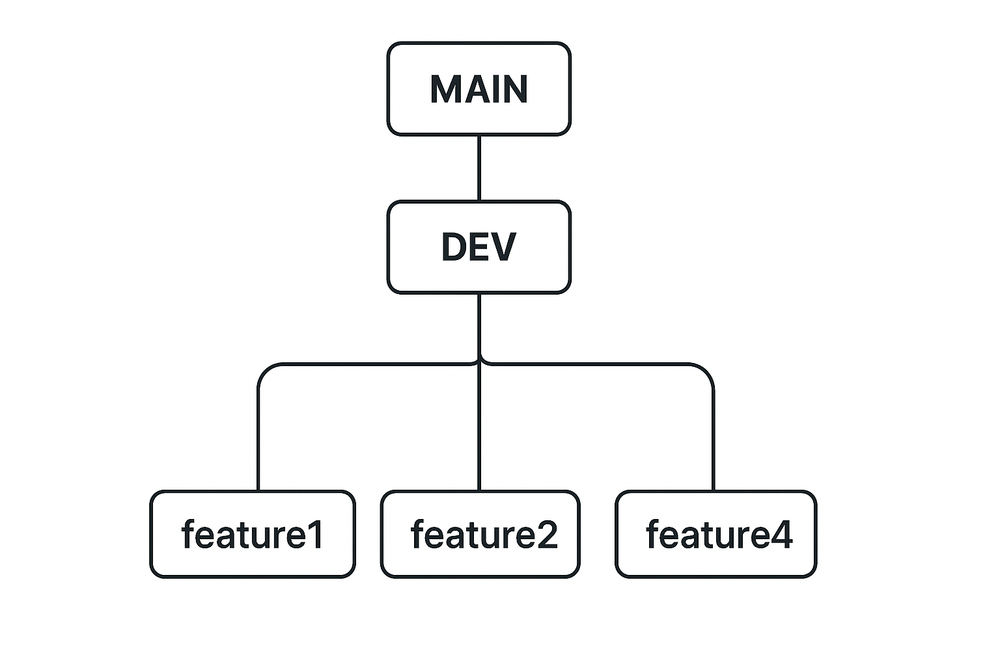

### Frontend Codebase Guide
---

#### Main tech stack:

- [Typescript](https://www.typescriptlang.org/) 
- [React](https://react.dev/) 
- [TailwindCSS](https://tailwindcss.com/) 
- [React Router (Data Mode)](https://reactrouter.com/start/data/installation/) for routing  
- [Lucide](https://lucide.dev/) for icons  
- [ShadCN](https://ui.shadcn.com/) for base components
- [Motion](https://motion.dev/) for reusable & quick animations
- [Vite](https://vite.dev/) build tool
- [Tanstack Query](https://tanstack.com/query/latest/docs/framework/react/overview) for fetching, caching, & synchronizing server states

---

### ⚙️ Local Setup 

#### 1. Prerequisites
Make sure you have:
- **Node.js 18+** 
- **pnpm** installed globally
```bash
# install pnpm using npm, or with other pkg managers, or manually on the internet.  
npm install -g pnpm 
```
#### 2. Clone and install this repository (Skip this step if you already did this once)
```bash
git clone https://github.com/isMaya404/thecozybudph && cd thecozybudph && pnpm install
```
#### 3. Run development server
###### ⚠️ NOTE ⚠️: This cmd only runs the frontend dev server and does not include the backend dev server since that is not needed. When you're creating a feature that involves an api call to the backend (e.g. a button that pre-orders a flower 'api/v1/pre-order/...' or a submitting a form with user input details to schedule an event), just message me and I'll just provide an api endpoint that's already deployed so you won't have to touch the backend at all.
```bash
pnpm dev:frontend
```
#### 4. Open the website
```bash
http://localhost:5173
```
---
### 📦 How to add a dependency
General packages:
```bash
# The usual "pnpm install <package-name>" won't work. You have to use:
 pnpm i <package-name> -F frontend # this installs the pkg inside frontend dir (folder) only
```
<br>

ShadCN components:
```bash
  pnpm dlx shadcn@latest add <component-name> --cwd ./frontend
```


---
### Frontend Directory Tree
- some guides on where you can put certain files (as the codebase grows this tree will get outdated, so think of this as a base structure)

```bash
frontend
├── components.json
├── eslint.config.js
├── index.html
├── package.json
├── public # static files
│   └── init-theme.js
├── src
│   ├── assets # you can put logos, icons, fonts, images used in components in here (I'll put all the flower img's in here temporarily and put them later on the cloud)
│   ├── components # dir for generic components 
│   ├── lib
│   │   ├── ui # you can add sub-dirs here for specific ui's (e.g ui/hero/some-hero-ui-file.tsx)
│   │   │   └── __shadcn__ # this is where all the shadcn components will go to after installing them
│   │   │       └── button.tsx # example shadcn component (use this button whenever you need a button)
│   │   └── utils
│   │       └── cn.ts # helper function when you needed logic inside classes
│   ├── main.tsx # entry point for react
│   ├── pages # you can add page components in here and export them to src/routes.ts after
│   │   ├── About.tsx # about page
│   │   ├── Home.tsx # home page 
│   │   └── Root.tsx # root page (highest in the dom tree except html and body)
│   ├── routes.ts # where you import page components 
│   ├── styles # only add another css file here if you have a specific usecase otherwise use tailwind for everything
│   │   └── index.css # contains base styles for tailwind
│   ├── tests # test cases
│   └── types # global ts types
```
---
### How To Contribute Code (Assumes Basic Git Knowledge)

##### Before I give the step by step guide on how contribute code, here are the branches we're gonna use for the whole process of developing this project:

### Branch Model 



#### main branch: production-ready features
- This is where the deployed website will source the code.  
- ⚠️ **You should not push your commits in here, open a pr, or touch this branch at all. this is where I'll merge code from dev branch only if the feature is already stable (bug free). I won't give access to this branch for safety.** ⚠️ 

#### dev branch: unstable features
- This is where you're gonna open a PR (Pull Request) - I'll explain later in the steps how.
- You should also **not** push your commits in here.

#### feature branch: feature development
- This is the branch where we’ll be working on.
- This is where you do the usual git add, commit, push commands.
- You can create as many feature branch as you want after finishing a feature and doing a pull request.

---
### Steps By Step Guide For Contributing Code:
- Just a side note. If you make a git command mistake, just google or ask AI how to undo the mistake you did. 90% of the time it's reversible.
- Tip: You can fork this repo and test/practice the steps below

#### 0. Do the setup guide above if not done already.

#### 1. Sync your local repo to remote **dev** branch 
```bash
# NOTE: you should run this regularly to detect and fix merge conflicts early (alteast 1x a day and before every git push)

# Also notice that the cmd is pulling from dev and not main. 
# That's important. Do not pull from main.
# It's always gonna be behind upstream from dev (outdated).

# skip this step if you recently just pulled.
git pull --rebase origin dev 
```

#### 2. Create a feature branch and switch to it
```bash
git branch feature/{nameOfTheFeature} # e.g. feature/event-scheduling
git switch feature/{nameOfTheFeature}

# or create and switch in one go 

git switch -c feature/{nameOfTheFeature} 
```

#### 3. Work on your feature locally and do the usual git workflow 
```bash
git add form.tsx someOtherFile.ts
git commit -m "added form for event event-scheduling"
# and other git cmd's you wanna do
```

#### 4. Push your code to your own remote branch
```bash
# Sync before pushing. If there's a merge conflict fix it.
git pull --rebase origin dev 

# NOTE: push only to your own branch, not in dev nor main.
git push feature/{nameOfYourBranch} 
```
⚠️ **AFTER PUSHING, IF THE FEATURE IS NOT YET 100% COMPLETE GO BACK TO STEP 3** ⚠️

#### 5. Open a Pull Request (PR) 

##### METHOD 1 (Github Website):
- Go to the repo: https://github.com/isMaya404/thecozybudph  
- If you successfully pushed, you should see a green button at the top right that says “Compare & pull request”. Click it.

- After clicking the button, set these up:   
   - Base branch: dev  
   - Compare branch: feature/{nameOfYourBranch}  
   - Add a descriptive title  
   - Add clear summary of what the feature does (screenshot if it's a ui).    
   <br>

- Finally, click the "Open Pull Request" button.

##### METHOD 2: 
   - using gh (github cli tool) - faster but cli based

#### 6. Code Review
- **Your code will be reviewed** (in this case, by me) and merged into the dev branch if no further changes are needed. Otherwise your code will be rejected and the reviewer will add a note as a guide on what you should improve or fix in your PR.

- If your PR is **aprroved:** go back to step 1

- If your PR is **not approved** and the reviewer requests changes:

  - **Make the requested fixes** locally in your code editor on the **same feature branch**  
  -  (Do **NOT** create a new PR or a new branch.)
  <br>

   ```bash
   # Make edits edits to your code locally... 

   git add someFile.tsx
   git commit -m "fix: address code review feedback"

   git pull origin dev # sync and resolve merge conflicts if any before pushing

   git push origin feature/{nameOfTheFeature} # this will automatically update the same PR

   # After pushing, Comment on the PR to let the reviewer know it’s ready for re-review.

   # NOTE: Don't wait for the code review (baka busy ako or di ko pa nakita).  
   # After opening a PR and you wanna work on other features just go back to step 1 on the spot
   ```

---

 ### Commit Rules/Guidelines:
 **Follow Conventional Commits for clarity and automation.**  

   - **Format** - {type}(optional scope): {short summary}
   - Examples:
      - feat: add user login form
      - fix(navbar): correct navbar color in dark mode
      - docs: update setup instructions in README
      - refactor: simplify button component logic
      - chore(config): bump dependencies

- **✅ DO'S :**  
  - Keep each commit focused — one logical change per commit.  
  - Write clear, descriptive messages that explain what and why (avoid vague terms like “update things” or “fix stuff”).  
  - Keep commits small and manageable — avoid dumping 1k+ line changes in one commit
  - Clearly label commits that address review feedback, e.g.  

    ```bash
    fix: address PR feedback (form validation)
    ```

- **🚫 DON'T :**
  - Open multiple PRs for the same feature  
  - Push directly to dev or main  
  - Force push on shared branches (in this case, dev or main)
